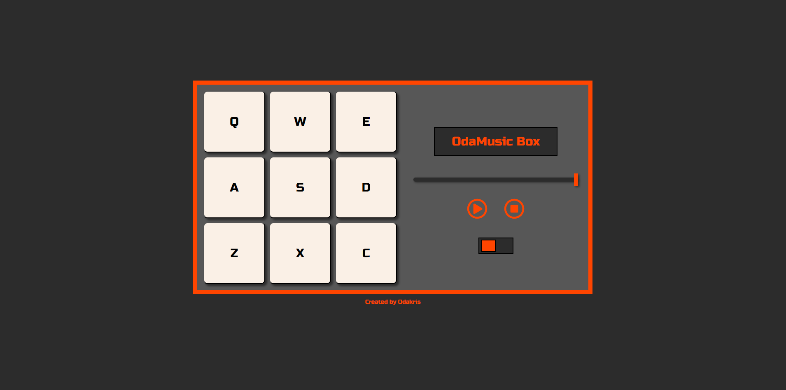

# FCC - Drum Machine Box


Live demo of **[Drum Machine Box](https://codepen.io/odakris/full/gOBMoKB)**

## Description

This is a drum machine box with two sound banks. It has a play/record function and a volume slider.

This project is part of the **[freeCodeCamp](https://www.freecodecamp.org/learn/front-end-development-libraries/)** Front End Development Libraries Projects certification.

<p align="center">
  
</p>

## Instructions

Clone this repository and install the NPM packages:

```
npm install
```

Next, install node-sass packages:

```
npm install node-sass
```

In the project directory, run the following script:

```
npm start
```

Open [http://localhost:3000](http://localhost:3000) to view it in the browser.
